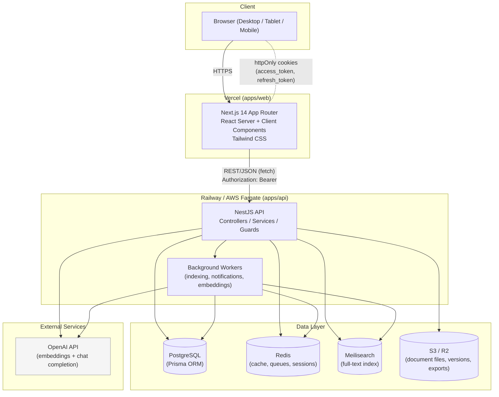
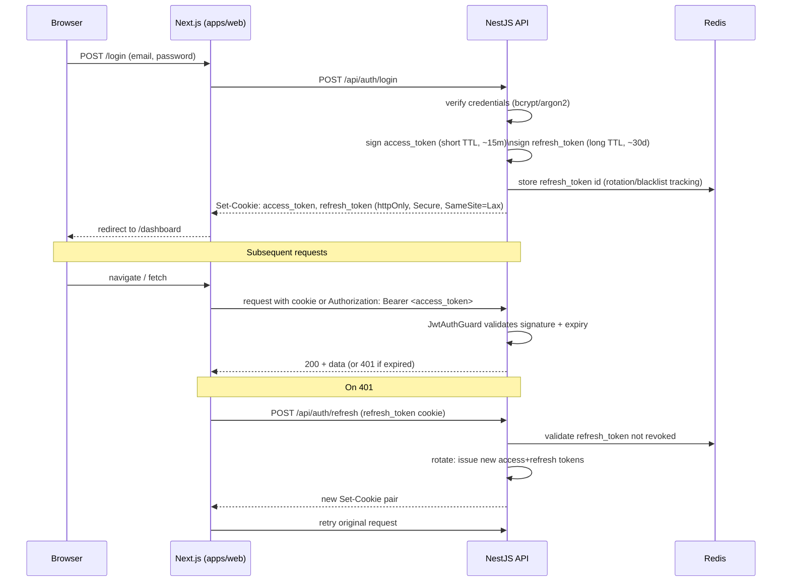
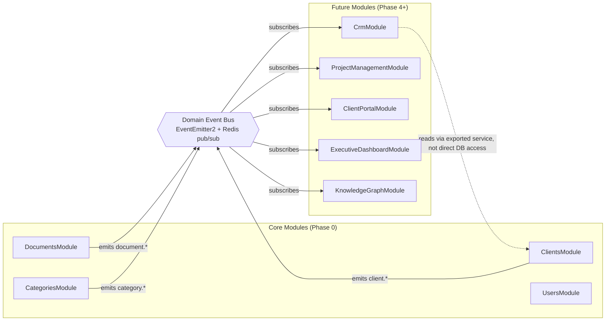

# System Architecture

## 1. Overview

Keyvantic KOS is a multi-service web application built as a pnpm workspaces monorepo. It separates concerns into a Next.js web client, a NestJS API service, and a set of managed/self-hosted infrastructure services (PostgreSQL, Redis, Meilisearch, S3/R2-compatible object storage, and the OpenAI API). Authentication is JWT-based (access + refresh tokens, httpOnly cookies) with a design compatible with Auth.js/Clerk session semantics, so it can be swapped for either without changing application code.



## 2. Service Responsibilities

| Service | Responsibility |
|---|---|
| **apps/web (Next.js 14)** | Server-rendered UI, route groups per feature area, client-side interactivity (editor, graph, chat), calls the API via a typed fetch client, holds no direct DB/storage access. |
| **apps/api (NestJS)** | All business logic: auth, RBAC enforcement, document lifecycle, versioning, search indexing triggers, AI retrieval orchestration, notifications, audit logging. Exposes a REST API consumed by `apps/web` (and, later, other clients). |
| **PostgreSQL** | System of record for all relational data — users, documents, versions, categories, relationships, comments, approvals, audit log, etc. Accessed exclusively through Prisma in `apps/api`. |
| **Redis** | Session/token blacklist cache, rate-limiting counters, BullMQ-style job queues (indexing, embedding generation, notification fan-out), short-lived response caches. |
| **Meilisearch** | Full-text and faceted search index over documents (title, body text, tags, category, metadata). Kept eventually-consistent with Postgres via an indexing worker triggered on document write/approve/archive. |
| **S3/R2-compatible storage** | Binary storage for uploaded files, generated exports (PDF/DOCX), and rendered attachments referenced by documents and versions. Accessed via signed URLs; never exposed directly to the browser without going through the API's authorization checks. |
| **OpenAI API** | Embeddings for semantic search and RAG, and chat completions for the AI Assistant. Only ever called from the API layer / workers — never from the browser — so retrieval scoping (approved-only, confidentiality-aware) is enforced server-side. |

## 3. Monorepo Layout

```
Keyvantic/
├── apps/
│   ├── web/                     # Next.js 14 App Router, TypeScript, Tailwind
│   │   ├── app/
│   │   │   ├── (auth)/          # sign-in, sign-up, forgot-password
│   │   │   ├── (dashboard)/     # authenticated app shell
│   │   │   │   ├── library/     # Master Library browser + documents
│   │   │   │   ├── search/
│   │   │   │   ├── graph/
│   │   │   │   ├── assistant/   # AI Assistant chat
│   │   │   │   ├── clients/
│   │   │   │   └── admin/       # roles, permissions, settings
│   │   │   └── layout.tsx
│   │   ├── components/
│   │   ├── lib/                 # api client, auth helpers, hooks
│   │   └── styles/
│   ├── api/                      # NestJS, Prisma, PostgreSQL
│   │   ├── src/
│   │   │   ├── modules/         # one folder per domain module (see below)
│   │   │   ├── common/          # guards, interceptors, filters, decorators
│   │   │   └── main.ts
│   │   └── prisma/
│   │       ├── schema.prisma
│   │       └── migrations/
│   └── (future) worker/          # optional standalone worker process, shares NestJS providers
├── packages/
│   └── types/                    # shared TypeScript types/DTOs/enums, published as an internal package
├── docs/                         # this documentation
├── docker-compose.yml
├── pnpm-workspace.yaml
└── package.json
```

`packages/types` is the contract boundary between `apps/web` and `apps/api`: request/response DTOs, enums (`DocumentStatus`, `Role`, `RelationType`, `ConfidentialityLevel`), and shared Zod schemas live here so both apps compile against the same shapes and a breaking API change surfaces as a type error at build time rather than a runtime bug.

## 4. Auth Flow (JWT, Auth.js/Clerk-compatible design)



Tokens are never stored in `localStorage`; the httpOnly cookie pattern combined with short-lived access tokens and rotated refresh tokens keeps the design swappable with NextAuth/Auth.js or Clerk session adapters later, since the contract (cookie-based session, `/api/auth/session` equivalent) is the same shape.

## 5. Extensibility Model — Adding Future Modules

KOS is designed so that the roadmap's future modules (CRM, Project Management, Proposal Generator, AI Transformation Assessment, Client Portal, LMS, Research Publishing, Executive Dashboard, Financial Dashboard, Knowledge Graph, Internal AI Copilot — see `07-development-roadmap.md`) can be added **without modifying the core document/category/user modules**. Three mechanisms make this possible:

1. **NestJS module boundaries.** Each domain lives in its own module (`DocumentsModule`, `CategoriesModule`, `ClientsModule`, ...). A new module (e.g. `CrmModule`) is registered in `AppModule` alongside existing ones, imports only what it needs (e.g. `ClientsModule` for client references), and exposes its own controllers/services. It does not reach into another module's Prisma repository directly — cross-module reads go through the other module's exported service, keeping a stable seam.

2. **New Next.js route groups.** The web app adds a new route group under `app/(dashboard)/` (e.g. `app/(dashboard)/crm/`, `app/(dashboard)/portal/`) with its own layout, reusing the shared shell (`Sidebar`, `TopBar`, `NotificationBell`) and shared components (`DocumentCard`, `StatusBadge`) from `components/`. Existing routes are untouched.

3. **Shared `packages/types` and domain events.** New modules consume the same enums/DTOs as core (e.g. a Proposal referencing a `Document` by its `KV-XX-###` id uses the shared `DocumentSummary` type). Cross-module side effects (e.g. "notify me when a linked document changes status") are handled through an internal event bus (NestJS `EventEmitter2` / a `DomainEventsModule` backed by Redis pub/sub for multi-instance deployments) rather than direct service calls: core modules **emit** events (`document.approved`, `document.status_changed`, `client.created`, `comment.created`) and any module — present or future — can **subscribe** without core code knowing subscribers exist. This is what already powers the Notifications module in Phase 0, and it is the extension point future modules plug into (e.g. Executive Dashboard subscribes to `document.approved` and `client.created` to update rollups; Knowledge Graph subscribes to `relationship.created`).



This keeps the blast radius of adding a module small: new Prisma models live in new schema files/sections with their own migrations, new modules are additive registrations in `AppModule`, and the UI grows by adding sibling route groups rather than editing existing ones.

## 6. Non-Functional Notes

- **Statelessness**: the API is stateless per-request (JWT-based), so it can run as multiple replicas behind a load balancer on Railway/ECS Fargate.
- **Caching**: Redis caches hot reads (category tree, permission matrix, popular documents) with short TTLs and explicit invalidation on writes.
- **Search consistency**: Meilisearch is a derived index, not the source of truth; it can be fully rebuilt from Postgres at any time via a reindex job.
- **Observability**: structured logging from NestJS interceptors, request IDs propagated from `apps/web`, and the `AuditLog` table as the durable record of who-did-what.
