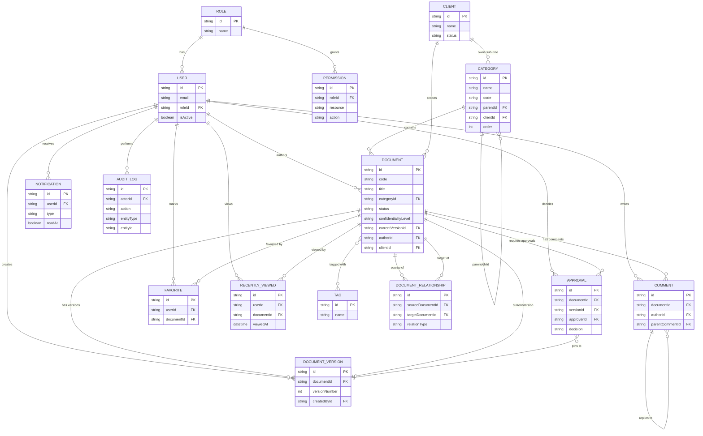

# Database Schema

## 1. Overview

KOS persists all relational data in PostgreSQL via Prisma. This document describes each model, its fields, relationships, and the key indexing/uniqueness constraints, followed by rationale for the more consequential design decisions. Field names/types below are descriptive (Prisma-style); the actual `schema.prisma` is the source of truth once implemented, but should match this shape.

## 2. Entity Reference

### User
| Field | Type | Notes |
|---|---|---|
| id | String (uuid/cuid) | PK |
| email | String | unique |
| passwordHash | String | nullable if SSO-only later |
| firstName, lastName | String | |
| avatarUrl | String? | S3/R2 key or URL |
| roleId | String | FK → Role |
| jobTitle | String? | |
| isActive | Boolean | default true; deactivation instead of delete |
| lastLoginAt | DateTime? | |
| createdAt, updatedAt | DateTime | |

Relations: `role`, `documentsAuthored` (Document[] via authorId), `versionsCreated` (DocumentVersion[]), `comments`, `approvals` (as approver), `favorites`, `recentlyViewed`, `notifications`, `auditLogEntries`.

### Role
| Field | Type | Notes |
|---|---|---|
| id | String | PK |
| name | Enum | `ADMINISTRATOR, PARTNER, CONSULTANT, RESEARCHER, DESIGNER, SALES, MARKETING, GUEST` — unique |
| description | String? | |
| createdAt, updatedAt | DateTime | |

Relations: `users` (User[]), `permissions` (many-to-many via `RolePermission` join, or direct `Permission[]` if modeled 1-to-many per action). The matrix is configurable at runtime (stored in DB, not hardcoded), so admins can adjust it without a deploy — see `08-security-architecture.md` for the default matrix.

### Permission
| Field | Type | Notes |
|---|---|---|
| id | String | PK |
| resource | Enum | e.g. `DOCUMENT, CATEGORY, CLIENT, USER, COMMENT, APPROVAL, AUDIT_LOG` |
| action | Enum | `CREATE, READ, UPDATE, DELETE, APPROVE, PUBLISH, EXPORT, MANAGE` |
| roleId | String | FK → Role |

Unique composite: `(roleId, resource, action)`.

### Category
Self-referential tree representing the Master Library.

| Field | Type | Notes |
|---|---|---|
| id | String | PK |
| name | String | e.g. "Strategy", "Company Profile" |
| code | String | short code used in document IDs, e.g. `BS` for "Business Strategy"; unique among siblings, indexed |
| parentId | String? | FK → Category.id (self-relation); null for the 9 top-level folders |
| order | Int | sort order among siblings |
| clientId | String? | FK → Client, set only for nodes under `09 Clients/<Client Name>/...` |
| description | String? | |
| createdAt, updatedAt | DateTime | |

Relations: `parent`/`children` (self-relation), `documents` (Document[]), `client` (optional).

Top-level seed rows: `01 Strategy, 02 Brand, 03 Advisory, 04 Research, 05 Sales, 06 Marketing, 07 Operations, 08 Products, 09 Clients`. Each client under `09 Clients` gets fixed sub-nodes: `Company Profile, Discovery Notes, Deliverables, Reports, Meeting Notes, AI Opportunities, Transformation Roadmap`.

### Document
| Field | Type | Notes |
|---|---|---|
| id | String | PK (internal id) |
| code | String | human-readable id, e.g. `KV-BS-001` (`KV-<category code>-<zero-padded sequence>`); **unique**, indexed |
| title | String | indexed for search fallback |
| summary | String? | short abstract, shown in list views and used as AI context snippet |
| categoryId | String | FK → Category |
| status | Enum | `DRAFT, INTERNAL_REVIEW, APPROVED, ARCHIVED` |
| confidentialityLevel | Enum | `PUBLIC, INTERNAL, CONFIDENTIAL, RESTRICTED` (see `08-security-architecture.md`) |
| currentVersionId | String? | FK → DocumentVersion (pointer to latest version, denormalized for fast reads) |
| authorId | String | FK → User |
| clientId | String? | FK → Client, set for client-scoped documents |
| dueForReviewAt | DateTime? | drives "review-due" notifications |
| archivedAt | DateTime? | |
| createdAt, updatedAt | DateTime | |

Relations: `category`, `author`, `client?`, `currentVersion`, `versions` (DocumentVersion[]), `tags` (many-to-many via `DocumentTag`), `outgoingRelationships` / `incomingRelationships` (DocumentRelationship[]), `comments`, `approvals`, `favorites`, `recentlyViewed`.

Indexes: unique on `code`; composite index on `(categoryId, status)` for library browsing; index on `(clientId)`; index on `(status, confidentialityLevel)` to support fast, safe search/AI filtering.

### DocumentVersion
Append-only version history — versions are never mutated or deleted, only added and (for restore) re-pointed-to.

| Field | Type | Notes |
|---|---|---|
| id | String | PK |
| documentId | String | FK → Document |
| versionNumber | Int | monotonically increasing per document, starting at 1 |
| content | Text/JSON | rich text content (Tiptap JSON) or reference to stored body |
| contentText | Text | plain-text extraction, used for Meilisearch indexing/diffing |
| fileUrl | String? | S3/R2 key if the version wraps an uploaded file (PDF, DOCX) rather than authored rich text |
| changeSummary | String? | free-text "what changed" note, optional but encouraged |
| createdById | String | FK → User |
| createdAt | DateTime | |

Unique composite: `(documentId, versionNumber)` — guarantees no two versions of the same document share a number and gives a natural, gap-free ordering for the version timeline / diff view.

### Tag
| Field | Type | Notes |
|---|---|---|
| id | String | PK |
| name | String | unique, case-insensitive |
| color | String? | for UI chips |

Relation: `documents` via `DocumentTag` join table (`documentId`, `tagId`, unique composite).

### DocumentRelationship
Typed graph edges between documents, powering the Graph View.

| Field | Type | Notes |
|---|---|---|
| id | String | PK |
| sourceDocumentId | String | FK → Document |
| targetDocumentId | String | FK → Document |
| relationType | Enum | `REFERENCES, SUPERSEDES, DERIVED_FROM, RELATED_TO, DEPENDS_ON, PART_OF` |
| createdById | String | FK → User |
| createdAt | DateTime | |

Unique composite: `(sourceDocumentId, targetDocumentId, relationType)` — the same two documents may be connected by more than one relation type, but not duplicated with the same type. The graph is directed; the UI can render `SUPERSEDES`/`DEPENDS_ON` with direction and `RELATED_TO` as undirected by rendering both ways or ignoring direction.

### Client
| Field | Type | Notes |
|---|---|---|
| id | String | PK |
| name | String | unique |
| industry | String? | |
| logoUrl | String? | |
| status | Enum | `PROSPECT, ACTIVE, PAST` |
| primaryContactName | String? | |
| primaryContactEmail | String? | |
| createdAt, updatedAt | DateTime | |

Relations: `categories` (the client's Master Library sub-tree), `documents`, `rootCategoryId` (FK → Category, the client's node under `09 Clients`).

### Comment
| Field | Type | Notes |
|---|---|---|
| id | String | PK |
| documentId | String | FK → Document |
| authorId | String | FK → User |
| body | Text | supports @mentions (stored as structured content or parsed refs) |
| parentCommentId | String? | self-relation for threaded replies |
| resolvedAt | DateTime? | |
| createdAt, updatedAt | DateTime | |

### Approval
Represents a single reviewer decision within a document's review cycle (a document may need approvals from multiple reviewers, e.g. Partner sign-off).

| Field | Type | Notes |
|---|---|---|
| id | String | PK |
| documentId | String | FK → Document |
| versionId | String | FK → DocumentVersion — pins the approval to the exact version reviewed |
| approverId | String | FK → User |
| decision | Enum | `PENDING, APPROVED, REJECTED, CHANGES_REQUESTED` |
| comment | String? | |
| decidedAt | DateTime? | |
| createdAt | DateTime | |

### Notification
| Field | Type | Notes |
|---|---|---|
| id | String | PK |
| userId | String | FK → User (recipient) |
| type | Enum | `APPROVAL_REQUESTED, DOCUMENT_APPROVED, REVIEW_DUE, COMMENT_MENTION, DEPENDENCY_CHANGED, DOCUMENT_ARCHIVED` |
| payload | JSON | polymorphic reference (documentId, commentId, etc.) |
| readAt | DateTime? | |
| createdAt | DateTime | |

Index on `(userId, readAt)` for fast "unread count" queries.

### AuditLog
Append-only, never updated or deleted (except by data-retention policy).

| Field | Type | Notes |
|---|---|---|
| id | String | PK |
| actorId | String? | FK → User (null for system actions) |
| action | String | e.g. `document.status_changed`, `user.role_updated` |
| entityType | String | e.g. `Document`, `User`, `Category` |
| entityId | String | |
| metadata | JSON | before/after snapshot or diff |
| ipAddress | String? | |
| createdAt | DateTime | |

Index on `(entityType, entityId)` and `(actorId, createdAt)`.

### Favorite
| Field | Type | Notes |
|---|---|---|
| id | String | PK |
| userId | String | FK → User |
| documentId | String | FK → Document |
| createdAt | DateTime | |

Unique composite: `(userId, documentId)`.

### RecentlyViewed
| Field | Type | Notes |
|---|---|---|
| id | String | PK |
| userId | String | FK → User |
| documentId | String | FK → Document |
| viewedAt | DateTime | updated (upserted) on each view, not appended indefinitely |

Unique composite: `(userId, documentId)`, with `viewedAt` updated on conflict; list views query `ORDER BY viewedAt DESC LIMIT N`.

## 3. Entity-Relationship Diagram

## 4. Key Indexes & Uniqueness Constraints

| Constraint | Table(s) | Purpose |
|---|---|---|
| `unique(code)` | Document | Guarantees `KV-BS-001`-style IDs never collide; used as the primary human-facing lookup key. |
| `unique(documentId, versionNumber)` | DocumentVersion | Enforces append-only, gap-free version sequencing per document; enables O(1) "get version N" lookups. |
| `unique(sourceDocumentId, targetDocumentId, relationType)` | DocumentRelationship | Prevents duplicate graph edges of the same type while allowing multiple relation types between the same pair. |
| `unique(userId, documentId)` | Favorite, RecentlyViewed | One row per user/document pair; upsert semantics instead of unbounded growth. |
| `unique(roleId, resource, action)` | Permission | One row per permission grant; the effective matrix is a lookup, not a scan. |
| `index(categoryId, status)` | Document | Fast Master Library browsing filtered by lifecycle state. |
| `index(status, confidentialityLevel)` | Document | Fast, safe filtering for search and AI retrieval scoping (approved + within clearance). |
| `index(entityType, entityId)` | AuditLog | Fast "show history for this record" queries. |
| `index(userId, readAt)` | Notification | Fast unread-count and inbox queries. |

## 5. Design Rationale

**Soft status workflow, not soft-delete.** Documents move through `DRAFT → INTERNAL_REVIEW → APPROVED → ARCHIVED` as an explicit state machine rather than being deleted. `ARCHIVED` retains full history and remains linkable/auditable; nothing is hard-deleted from the Document/DocumentVersion tables in normal operation. This matches a consulting firm's need to retain provenance for every deliverable indefinitely (compliance, client disputes, institutional memory) and keeps the AI assistant's retrieval scope (`APPROVED` only) a simple filter rather than a data-loss risk.

**Append-only version history.** `DocumentVersion` rows are never edited or deleted; "restore" creates a **new** version whose content matches an old one and repoints `Document.currentVersionId`, rather than mutating history. This gives an honest, tamper-resistant audit trail, makes diffing trivial (compare any two immutable snapshots), and means the version timeline UI can render straightforwardly by `versionNumber ASC`.

**Self-referential category tree.** A single `Category` table with `parentId` self-relation supports arbitrary depth (top-level folder → sub-folder → client sub-section) without a rigid fixed-depth schema, while `code` at each node composes into the document ID. Client sub-trees (`Company Profile`, `Discovery Notes`, etc.) are just ordinary category rows with `clientId` set, so no separate "client document" table is needed — the same Document/Category machinery serves both firm-wide and client-scoped content.

**Many-to-many document relationships with typed edges.** Modeling relationships as their own table with a `relationType` enum (rather than ad hoc foreign keys like `supersedesId` on Document) allows an arbitrary number of typed connections per document and is what makes the Graph View possible: it is a directed graph query (`DocumentRelationship` rows) layered on top of the document catalog, extensible with new relation types without a schema migration touching `Document` itself.

**Denormalized `currentVersionId` on Document.** Nearly every read of a document needs its latest content; storing the pointer avoids a `MAX(versionNumber)` subquery on every document fetch, at the cost of one extra write when a version is created/restored (acceptable since writes are far less frequent than reads).

**Confidentiality as a first-class column, not inferred from category.** `confidentialityLevel` lives on `Document` directly (not derived from its category) because sensitivity can vary within a category (e.g. a `CONFIDENTIAL` client deliverable next to an `INTERNAL` meeting note in the same client folder), and because search/AI retrieval filtering needs a single indexed column to check per request — see `08-security-architecture.md`.
