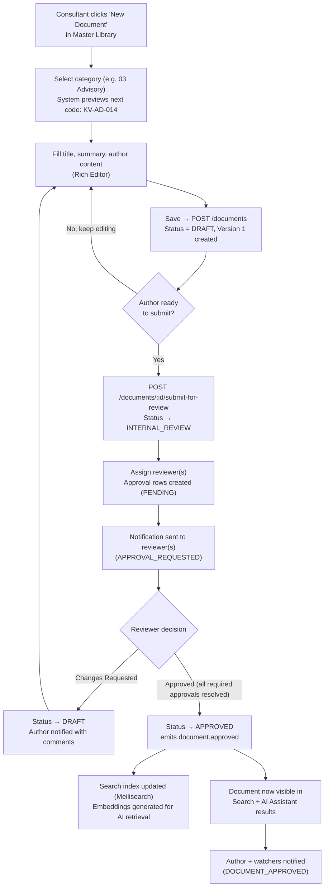
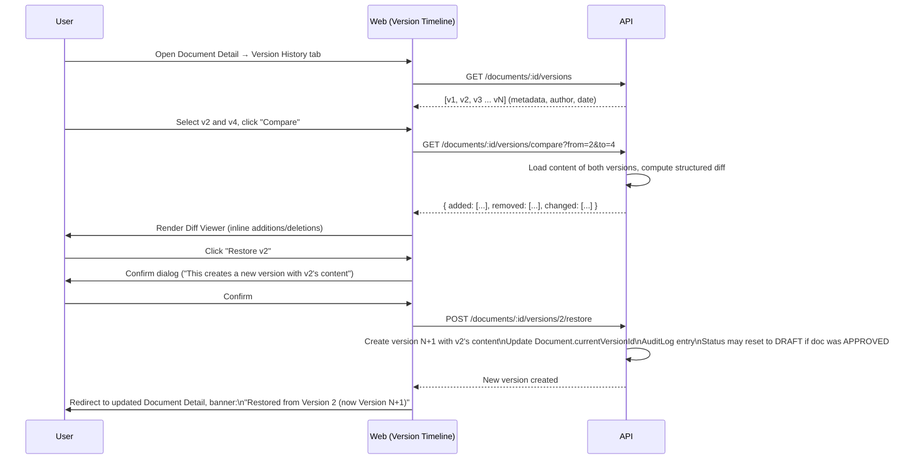
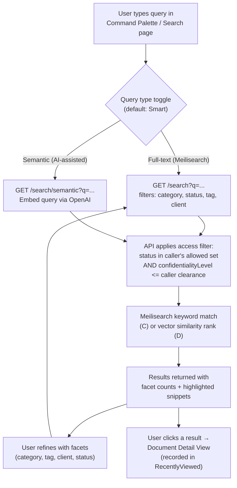
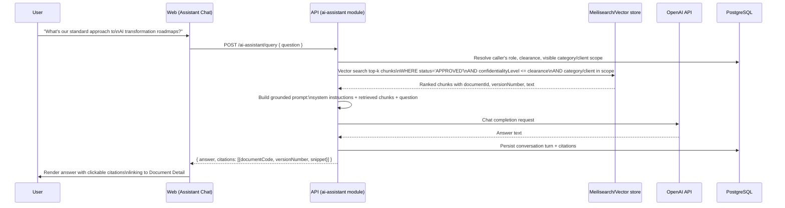
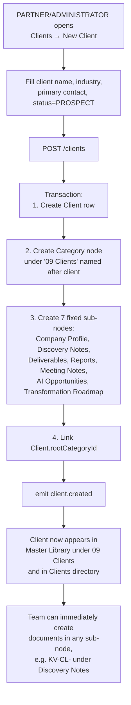
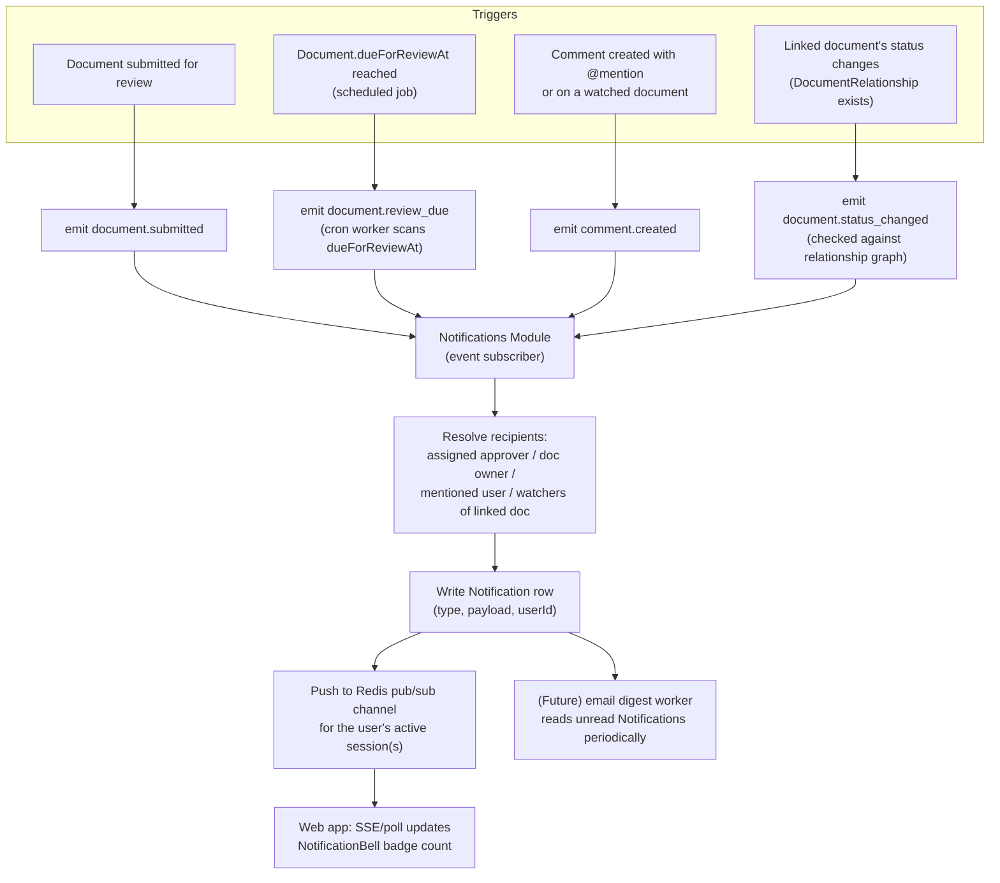

# User Flows

## (a) Document Creation → Draft → Internal Review → Approval → Published

**Notes**: submitting for review pins the reviewed content to the current `DocumentVersion` (via `Approval.versionId`), so if the author edits again before approval completes, a new version resets the review (status returns to `DRAFT`, new `Approval` cycle needed) — this prevents approving content the reviewer never actually saw.

## (b) Version Compare & Restore

## (c) Full-Text / Semantic Search

## (d) AI Assistant Q&A Restricted to Approved Documents

If no approved, in-scope document contains relevant content, the assistant explicitly says so rather than answering from general model knowledge or from `DRAFT`/`ARCHIVED`/out-of-clearance material — this boundary is enforced server-side in the retrieval query, not just by prompt instructions (see `08-security-architecture.md` §6).

## (e) New Client Onboarding — Creating the Client Sub-Tree

## (f) Notification Delivery — Approval / Review-Due / Comment / Dependency-Change

Notification types map directly to the `Notification.type` enum: `APPROVAL_REQUESTED, DOCUMENT_APPROVED, REVIEW_DUE, COMMENT_MENTION, DEPENDENCY_CHANGED, DOCUMENT_ARCHIVED`. Because delivery is event-driven, future modules can add new trigger sources (e.g. a Project Management module emitting `task.assigned`) without changing the Notifications module itself — it already generically fans an event out to resolved recipients.
