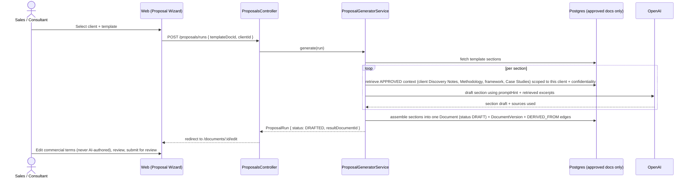

# Proposal Generator — Feature Spec

Status: **Draft for review** (not yet built). Scoped as the first Phase 4 module referenced in `docs/07-development-roadmap.md`.

## 1. Problem

Today, writing a proposal means a consultant or salesperson manually:
1. Opening the Standard Proposal Template (`KV-PT-001`)
2. Pulling context from the client's Discovery Notes, the Consulting Methodology, and the relevant framework (e.g. KEYSHIFT)
3. Hand-copying and rewriting sections to fit the client
4. Getting it reviewed and approved

All the inputs already live in the KOS as structured, approved documents. The Proposal Generator turns that manual assembly into a guided, AI-assisted draft — while keeping a human in the loop for anything that touches scope or price.

**Goal:** cut first-draft time from hours to minutes, without producing a proposal nobody reviewed.

**Non-goal:** fully autonomous proposal sending. Every generated proposal is a `DRAFT` document that goes through the existing approval workflow before it becomes a client-facing deliverable.

## 2. Where it plugs into the existing system

Nothing here requires a new subsystem — it's a new NestJS module (`ProposalsModule`) and a new Next.js route group (`/proposals`) that compose existing primitives:

| Existing primitive | Role in the Proposal Generator |
|---|---|
| `Document` (`isTemplate: true`) | The source template, e.g. `KV-PT-001` |
| `Category` under `09 Clients/<Client>` | Where the generated proposal is filed (`Deliverables`) |
| `DocumentRelationship` (`DERIVED_FROM`) | Links the generated proposal back to the template *and* to the framework/methodology docs it drew from — this is the same edge type already used for `KV-ACME-DELIV-001 → KV-PT-001` in the seed data |
| `AiClientService` / RAG retrieval pattern | Reused verbatim: same confidentiality-scoped retrieval used by the AI assistant, just pointed at one client's folder instead of the whole library |
| `DocumentVersion` | Each generation attempt, and each edit pass, is a version — full history of "what the AI drafted" vs. "what a human changed" for free |
| `Approval` workflow | Generated proposal starts life as `DRAFT`, moves to `INTERNAL_REVIEW` → `APPROVED` exactly like any other document |
| `ConfidentialityLevel` | Generated proposals default to `CONFIDENTIAL` |

The only genuinely new concepts are a **template structure** (named sections instead of one blob of markdown) and a **generation run** (an auditable record of what was asked for and what came back).

## 3. Data model additions

```prisma
model ProposalTemplateSection {
  id            String   @id @default(cuid())
  templateDocId String                      // the Document with isTemplate: true
  templateDoc   Document @relation("TemplateSections", fields: [templateDocId], references: [id], onDelete: Cascade)
  key           String                      // "executive_summary" | "diagnosis" | "roadmap" | "commercial_terms" | "team_governance"
  title         String                      // "Executive Summary"
  sortOrder     Int
  promptHint    String?  @db.Text           // section-specific instruction, e.g. "Lead with the client's stated pain point, not ours."
  requiresHuman Boolean  @default(false)    // true for Commercial Terms / pricing — AI drafts a placeholder, never a number

  @@unique([templateDocId, key])
}

model ProposalRun {
  id               String            @id @default(cuid())
  templateDocId    String
  templateDoc      Document          @relation("TemplateRuns", fields: [templateDocId], references: [id])
  clientId         String
  client           Client            @relation(fields: [clientId], references: [id])
  requestedById    String
  requestedBy      User              @relation(fields: [requestedById], references: [id])
  resultDocumentId String?           // set once the run produces a Document
  resultDocument   Document?         @relation("ProposalRunResult", fields: [resultDocumentId], references: [id])
  status           ProposalRunStatus @default(GENERATING)
  sourceDocumentIds Json             // which approved docs were actually retrieved and used, for audit
  createdAt        DateTime          @default(now())
  completedAt      DateTime?
}

enum ProposalRunStatus {
  GENERATING
  DRAFTED
  FAILED
}
```

`Document.contentMarkdown` stays a single blob at the version level (no schema change there) — sections are a generation-time and editing-time concept, assembled into one document on save, same as the existing rich editor.

## 4. Generation flow



Key rule carried over from the AI assistant: **retrieval for a client's proposal is scoped to that client's own folder plus firm-wide approved methodology/framework/template docs — never another client's Discovery Notes or Deliverables.** This is a straightforward extension of the existing confidentiality filter (`categoryId` scoping added to the existing `retrieveApprovedContext`-style query).

Sections flagged `requiresHuman` (commercial terms, specific pricing, contractual language) are never sent to the LLM for drafting — the generator inserts a structured placeholder (`[[PRICING TABLE — fill in from KV-PRC-*]]`) and the section is visibly marked incomplete until a human fills it in. This is the main guardrail against a hallucinated number ending up in front of a client.

## 5. API surface

| Method | Path | Purpose |
|---|---|---|
| `GET` | `/proposal-templates` | List documents with `isTemplate: true` and their sections |
| `POST` | `/proposal-templates/:docId/sections` | Define/reorder template sections (Partner/Admin only) |
| `POST` | `/proposals/runs` | Start a generation run `{ templateDocId, clientId }` |
| `GET` | `/proposals/runs/:id` | Poll run status (generation is async — sections stream in) |
| `GET` | `/proposals/runs?clientId=` | History of proposal runs for a client |
| `POST` | `/proposals/runs/:id/regenerate-section` | Redo one section with a new instruction, without touching the rest |

Generation runs asynchronously (NestJS `@nestjs/schedule`/a lightweight job via Redis, already a dependency) rather than blocking the request — a multi-section draft calling an LLM per section can take 10–30s, and the UI should show per-section progress rather than a single spinner.

## 6. UI/UX

A three-step wizard under `/proposals/new`, reusing existing components (`DocumentCard`, `StatusBadge`, the Tiptap `RichEditor`):

1. **Pick client + template** — client picker (existing `/clients` list), template picker (documents flagged `isTemplate`).
2. **Generating** — one row per section with a live status (`queued` → `drafting` → `done`), each showing which source documents it pulled from (same citation-chip pattern as the AI assistant).
3. **Review & edit** — opens straight into the existing document editor, pre-populated, with sections needing human input visibly flagged (a `pill-review`-style badge reading "Needs pricing"). Saving here behaves exactly like any other document edit — new `DocumentVersion`, same status workflow.

No new design language needed — this is the existing Keyvantic KOS visual system applied to one more flow.

## 7. Permissions

Reuses the existing permission matrix — no new roles:

- `proposal:generate` (new action) — granted by default to Partner, Consultant, Sales (mirrors who already has `client:manage` / `document:create`)
- Everything after generation (`document:update`, `document:submit_review`, `document:approve`) uses the permissions that already exist today

## 8. Risks & mitigations

| Risk | Mitigation |
|---|---|
| AI invents pricing or scope commitments | Commercial terms are never model-drafted (§4) |
| Client A's data leaks into Client B's proposal | Retrieval hard-scoped by `clientId` → category subtree, same enforcement pattern as confidentiality scoping today |
| Draft looks "finished" and skips review | Generated documents always start at `DRAFT`; sections with `requiresHuman` block submission for review until filled |
| Template drift (template changes, old runs go stale) | `ProposalRun.sourceDocumentIds` records exactly what was used, so any output is traceable back to a specific template + document versions |
| No OpenAI key configured | Same graceful degradation as the AI assistant — falls back to inserting the raw retrieved excerpts per section rather than failing the run |

## 9. Phased rollout

- **v1 (this spec):** template + section model, RAG-drafted non-pricing sections, human-required pricing sections, full approval workflow reuse.
- **v2:** pull structured numbers from `05 Sales/Pricing` documents automatically (still surfaced for human confirmation, not silently inserted).
- **v3:** win/loss feedback loop — when a proposal's linked `Client` moves to `ACTIVE`, tag the proposal as a reference case study candidate for `05 Sales/Case Studies`.

## 10. Effort estimate

Roughly the same order of magnitude as the Documents + Versions modules already built: 2 new Prisma models, 1 new NestJS module (~6 files), 1 new frontend route group (~4 pages), reusing the existing editor/graph/RAG infrastructure rather than building anything from scratch. The async job runner (per-section generation) is the only genuinely new infrastructure piece.
