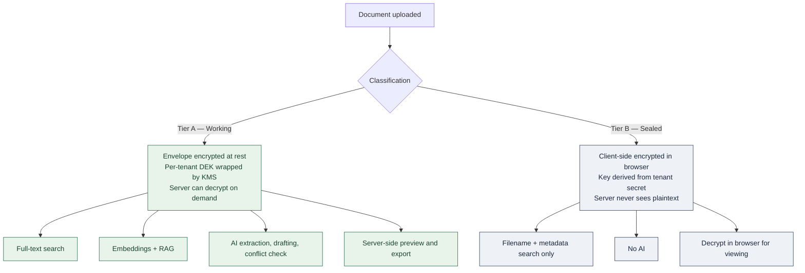

# SaaS Product Scope — Secure AI-Powered CRM with a Vault for Professionals

**Status**: Scoping draft for decision. Nothing here is built yet.
**Relationship to existing docs**: `01`–`09` describe KOS as a single-tenant internal system for Keyvantic. This document scopes the pivot to a multi-tenant commercial product. Where the two conflict, this document supersedes.

---

## 1. Product Definition

### 1.1 What we are building

A multi-tenant SaaS platform for professional services firms that unifies three things currently bought separately:

1. **A CRM** that understands engagements, matters, and referral relationships — not sales quotas.
2. **A secure document vault** with encryption, granular sharing, retention, and a defensible access record.
3. **An AI layer** grounded exclusively in the firm's own material, with citations.

### 1.2 Why the combination is the product

Each piece exists on its own and each is weak on its own:

| Existing option | What it does well | Why professionals work around it |
|---|---|---|
| Salesforce / HubSpot | Pipeline, reporting, integrations | No secure document handling; confidential client files end up in email and Dropbox anyway |
| SharePoint / Dropbox / Box | File storage, sharing | No relationship model; no idea a document belongs to a matter with a conflict check |
| iManage / NetDocuments | Document management for law | Expensive, dated UX, weak CRM, AI bolted on |
| ChatGPT / Copilot | Fluent generation | Ungrounded; firms cannot put privileged client material into it |

The wedge: **a professional's client relationship and that client's confidential documents are the same object, and no tool treats them that way.** A matter has parties, deadlines, obligations, a document set, and a confidentiality boundary. Modelling that once — then letting AI reason over it inside the boundary — is the product.

### 1.3 Target customer

Primary beachhead: **small-to-midsize professional services firms, 5–150 fee earners**, in a vertical where client confidentiality is a professional obligation rather than a preference:

- Law firms (highest willingness to pay, highest compliance bar)
- Accounting and audit practices
- Management consultancies
- Wealth management and financial advisory
- Architecture and engineering practices

Rationale for the size band: below 5 people there is no budget and no compliance pressure; above 150 the buyer demands SOC 2, SSO, and a procurement process we will not clear for 12+ months.

**Recommendation: pick one vertical for v1.** The data model differences between a law firm's matters and a consultancy's engagements are small; the *vocabulary*, workflow, and compliance expectations are not. Building for "professionals" generically produces a product that loses every head-to-head.

### 1.4 What we already have

The existing KOS codebase is roughly **35–40% of the document half** of this product and **0% of the CRM, vault, tenancy, and commercial halves**.

| Reusable largely as-is | Reusable with rework | Not started |
|---|---|---|
| Document + version model (append-only versioning is exactly right) | RBAC — needs tenant and matter scoping | Multi-tenancy |
| Approval workflow and state machine | Client model — needs to become Organization + Engagement | Encryption / vault |
| Audit log shape | Search — needs tenant isolation | File upload and storage |
| Comments, notifications, tags | AI service — needs per-tenant isolation and citations | CRM domain entirely |
| Relationship graph | Confidentiality levels — designed but not enforced | Billing, provisioning, onboarding |
| Tiptap editor, Next.js UI shell | | SSO, MFA, SCIM |

---

## 2. The Central Tension: "Vault" vs "AI-Powered"

**This is the most important decision in the document, and it cannot be deferred.**

A true zero-knowledge vault means the server never holds plaintext or keys. That is what "vault" implies to a security-conscious buyer, and it is what competitors like Tresorit sell.

But server-side search, embeddings, and RAG all require plaintext. **You cannot have zero-knowledge encryption and server-side AI over the same document.** Any vendor claiming both is either not zero-knowledge or not doing the AI server-side.

### 2.1 Recommended resolution: two-tier classification

Let the customer decide per document, with a firm-level default.



**Tier A (Working)** is the default and covers the large majority of documents. Envelope encryption with per-tenant data encryption keys wrapped by a KMS customer master key. Protects against storage compromise, backup theft, and cross-tenant leakage — the realistic threats. Does **not** protect against a compromised application server, and we must never market it as if it does.

**Tier B (Sealed)** is for the genuinely untouchable: settlement terms, M&A target lists, personnel investigations. Encrypted in the browser before upload. The server stores ciphertext and metadata only. No search, no AI, no server-side preview.

### 2.2 Marketing constraint

Write this into the messaging guidelines now, before a salesperson invents it:

- ✅ "Encrypted at rest with per-firm keys, in transit, and in backups"
- ✅ "Sealed documents are encrypted in your browser — we cannot read them"
- ❌ "Zero-knowledge" applied to the whole product
- ❌ "We can't see your data" as a blanket claim

A security-literate buyer will test this claim in the first call, and getting caught overstating it loses the deal and the reference.

### 2.3 Deferred option

Client-side embedding generation (models running in-browser via WebAssembly) would eventually allow semantic search over Tier B. Real but immature. Park it as a differentiator for year two, not a v1 commitment.

---

## 3. Tenancy Architecture

### 3.1 Options

| Model | Isolation | Ops cost | Cost per tenant | Verdict |
|---|---|---|---|---|
| Shared schema, `tenantId` column | Application-enforced | Low | Low | Risky alone — one missing `WHERE` leaks data |
| Shared schema + Postgres RLS | **Database-enforced** | Low | Low | **Recommended** |
| Schema per tenant | Strong | High — migrations × N | Medium | Migration pain at scale |
| Database per tenant | Strongest | Highest | High | Enterprise tier only |

### 3.2 Recommendation: shared schema with Row-Level Security

Every table gets a `tenantId`. Postgres RLS policies filter on a session variable that a Prisma middleware sets from the authenticated JWT on every request.

```sql
ALTER TABLE "Document" ENABLE ROW LEVEL SECURITY;
CREATE POLICY tenant_isolation ON "Document"
  USING ("tenantId" = current_setting('app.tenant_id')::text);
```

The reason this beats a `tenantId` column alone is not elegance — it is that **tenant isolation stops depending on every developer remembering it.** A forgotten filter in a new endpoint returns zero rows instead of another firm's client list. Given that a single cross-tenant leak ends a company selling to law firms, that property is worth the setup cost.

**Enterprise escape hatch**: the same schema deployed to a dedicated database, selected by a connection-string lookup at the tenant level. Sell it as "dedicated instance" for firms that demand it. No code fork.

### 3.3 Search isolation

Meilisearch is a second isolation boundary that RLS does not cover. Two options: one index per tenant, or shared index with tenant tokens.

**Recommendation: drop Meilisearch and move to Postgres full-text search plus `pgvector`.** Rationale:

- Isolation collapses to a single boundary (RLS) instead of two systems that must agree
- Removes an infrastructure component, its scaling behaviour, and its per-tenant index-count ceiling
- pgvector is needed anyway for embeddings, so semantic and keyword search share one store
- The existing `SearchService` already has a Postgres fallback path — it is partly written

The cost is weaker relevance ranking and no typo tolerance out of the box. For a corpus of firm documents, where users search by known client name and document type, that trade is acceptable. Revisit if search quality becomes a churn reason.

### 3.4 The migration is the reason to do this now

Adding `tenantId` to 17 existing models plus RLS policies is a mechanical but wide change. It touches every query in the API. Doing it **before** any customer data exists is a two-to-three week job. Doing it after is a multi-month migration with a data-integrity risk at the end. This must be the first phase.

---

## 4. Domain Model

### 4.1 Platform and tenancy

```prisma
model Tenant {
  id              String   @id @default(cuid())
  name            String
  slug            String   @unique      // subdomain: acme.product.com
  vertical        String                // LAW | ACCOUNTING | CONSULTING | ...
  kmsKeyId        String                // per-tenant CMK reference
  dataRegion      String   @default("eu-west-1")
  status          String   @default("TRIAL")
  // subscription, members, and every domain table hang off this
}

model TenantMember {
  tenantId  String
  userId    String
  roleId    String            // role is per-tenant, not global
  status    String            // INVITED | ACTIVE | SUSPENDED
  @@id([tenantId, userId])
}
```

Note the shape change: `User.roleId` becomes `TenantMember.roleId`. A user can belong to more than one tenant (contractors, fractional CFOs, multi-firm partners) with a different role in each. Retrofitting that later is painful.

### 4.2 CRM

```prisma
model Organization {   // supersedes the current thin `Client`
  id, tenantId, name, type          // CLIENT | PROSPECT | REFERRER | COUNTERPARTY | SUPPLIER
  industry, website, addresses
  ownerId                            // relationship owner
  healthScore                        // AI-derived, §6.4
}

model Contact {
  id, tenantId, organizationId?
  name, email, phone, title
  isKeyContact, lastInteractionAt
}

model Engagement {   // "Matter" in law, "Engagement" in consulting, "Case" elsewhere
  id, tenantId, organizationId
  reference                          // firm's own matter number
  name, practiceArea, status
  leadId, teamMembers                // ← the confidentiality boundary lives here
  openedAt, closedAt
  retentionPolicyId, legalHold
  billingType, feeArrangement
}

model Opportunity {
  id, tenantId, organizationId, engagementId?
  name, stageId, value, currency, probability
  expectedCloseAt, source, lostReason
}

model Pipeline / PipelineStage { ... }   // configurable per tenant

model Activity {
  id, tenantId, type                 // EMAIL | CALL | MEETING | NOTE | TASK
  organizationId?, contactId?, engagementId?, opportunityId?
  subject, body, occurredAt, durationMinutes
  createdById, source                // MANUAL | EMAIL_SYNC | CALENDAR_SYNC
}

model Task { ... }                   // assignee, due date, links to any entity
model CustomField / CustomFieldValue  // per-tenant extensibility without schema changes
```

**`Engagement` is the load-bearing entity.** It is where the team is defined, therefore where the confidentiality boundary is enforced, therefore what every access check resolves against. The current `Client` model's single root category is not sufficient — one client routinely has several matters with deliberately non-overlapping teams.

### 4.3 Vault

```prisma
model VaultItem {
  id, tenantId
  engagementId?, organizationId?     // what it belongs to
  name, itemType                     // FILE | AUTHORED_DOCUMENT
  documentId?                        // → existing Document model for authored content
  classification                     // TIER_A_WORKING | TIER_B_SEALED
  confidentiality                    // existing enum, now actually enforced
  retentionPolicyId, legalHold
  deletedAt
}

model VaultFile {
  id, vaultItemId, versionNumber
  storageKey                         // S3/R2 object key
  sizeBytes, mimeType, checksumSha256
  encryptedDek                       // per-file DEK, wrapped by tenant DEK
  encryptionAlgo, iv
  extractedText?                     // Tier A only — feeds search + AI
  uploadedById, uploadedAt
}

model ShareGrant {
  id, tenantId, vaultItemId
  granteeType                        // INTERNAL_USER | EXTERNAL_EMAIL | LINK
  granteeRef
  permission                         // VIEW | DOWNLOAD | COMMENT | EDIT
  expiresAt, maxDownloads, passwordHash?
  watermark, revokedAt
}

model AccessLog {
  id, tenantId, vaultItemId, actorRef
  action                             // VIEW | DOWNLOAD | PRINT | SHARE | REVOKE
  ipAddress, userAgent, occurredAt
  prevHash, hash                     // hash-chained, §5.5
}

model RetentionPolicy {
  id, tenantId, name
  retainForMonths, afterEvent        // ENGAGEMENT_CLOSE | LAST_ACCESS | CREATION
  action                             // NOTIFY | ARCHIVE | CRYPTO_SHRED
}
```

The distinction between `Document` (authored in the editor, versioned as markdown) and `VaultFile` (uploaded binary) is worth keeping — they have genuinely different lifecycles. `VaultItem` is the common parent so that sharing, retention, access logging, and AI retrieval work uniformly across both.

---

## 5. Security Architecture

### 5.1 Encryption

**At rest**: envelope encryption. Per-file DEK (AES-256-GCM) → wrapped by per-tenant DEK → wrapped by a KMS customer master key. Rotation happens at the KMS layer without re-encrypting objects.

**Why per-tenant keys** beyond defence in depth: they make crypto-shredding possible (§5.4) and they make "your data is encrypted with a key unique to your firm" a true statement in a security questionnaire.

**BYOK / CMK** for enterprise tiers — customer supplies their own KMS key. Frequently asked, rarely used, and cheap to support if the key hierarchy is designed for it from the start. Retrofitting it is not cheap.

**In transit**: TLS 1.3 everywhere; HSTS; certificate pinning on mobile if we ever ship it.

### 5.2 Authentication and access

| Control | Scope | Notes |
|---|---|---|
| SSO (SAML + OIDC) | All paid tiers | **Build-vs-buy: buy.** WorkOS or Auth0 Enterprise. Hand-rolling SAML is weeks of work and a recurring source of vulnerabilities |
| SCIM provisioning | Enterprise | Deprovisioning is the actual requirement — firms need departures to revoke access immediately |
| MFA (TOTP + WebAuthn) | All tiers, enforceable per tenant | WebAuthn preferred; TOTP as fallback |
| Session management | All | Device list, remote revoke, configurable idle timeout |
| IP allowlisting | Enterprise | Common ask from law firms |

### 5.3 Authorization

Three layers, all server-side, all enforced in one place:

1. **Tenant** — RLS, database-enforced (§3.2)
2. **Engagement** — is the user on this engagement's team? Plus explicit *deny* entries for ethical walls and conflicts
3. **Classification** — does the user's clearance meet the item's confidentiality level?

The critical implementation rule, learned from the existing codebase: **one visibility predicate, called by every read path** — list, get, search, export, AI retrieval, notification content. The current code has three divergent implementations of confidentiality filtering across `documents`, `search`, and `ai`, and the search path only restricts GUEST. That pattern must not survive into a multi-tenant product.

### 5.4 Right to erasure vs. immutable audit

GDPR erasure and append-only version history are in direct conflict. Resolution: **crypto-shredding.** Destroy the key rather than the ciphertext. The audit record of the document's existence, its versions, and who accessed it survives; the content becomes permanently unrecoverable. This satisfies both the regulator and the professional-obligation requirement to prove what happened.

This is only possible if key hierarchy is granular enough — another reason to settle key design in Phase 0.

### 5.5 Audit integrity

Hash-chain the audit and access logs: each row stores the hash of the previous row plus its own content hash. Makes tampering detectable, including by someone with database write access. Publish a periodic chain checkpoint to append-only storage.

This is a direct answer to a question that every enterprise security review asks and that the current `AuditLog` — ordinary mutable rows — fails.

### 5.6 AI-specific security

Often skipped. All four matter:

1. **Zero data retention** — use provider endpoints that do not retain or train on inputs. Get it in the contract, then restate it in the DPA.
2. **Tenant isolation of embeddings** — vectors carry recoverable information about source text. Same RLS boundary, no shared index.
3. **Prompt injection** — uploaded documents are *untrusted input*. A malicious PDF in a counterparty's disclosure bundle can carry instructions. Never give the model tool access to tenant data in a loop driven by document content; treat retrieved text as data, never as instructions.
4. **Citation integrity** — every AI answer must name its sources and be traceable to the exact version retrieved. This is both a trust feature and a liability shield.

### 5.7 Compliance path

| Milestone | Calendar | Trigger |
|---|---|---|
| Security policy set, DPA, subprocessor list | Month 1–2 | First paying customer |
| Penetration test (external) | Month 4 | Before general availability |
| SOC 2 Type I | Month 6 | First deal that asks |
| SOC 2 Type II | Month 12–18 | Requires 6–12 months of evidence |
| ISO 27001 | Year 2 | European enterprise demand |
| Data residency (EU/UK) | Month 6+ | Design for it now, deploy on demand |

SOC 2 Type II cannot be accelerated — the observation window is fixed. Start the control evidence collection early even if the audit is later.

---

## 6. AI Capabilities

"AI-powered" needs to mean specific things a professional would pay for, not a chat box.

### 6.1 Grounded Q&A (extends what exists)

Ask questions across the firm's corpus; answers cite document, version, and page. Scoped to what the user may see. The existing `ai.service.ts` is a rough starting point but needs tenant isolation, engagement scoping, real citations, and an honest "not found in your documents" path.

### 6.2 Extraction → CRM population

The highest-leverage feature, and the one that makes the vault and the CRM one product instead of two. On upload of a Tier A document, extract:

- Parties, roles, and counterparties → match to `Organization` / `Contact`
- Key dates: effective, renewal, expiry, notice deadlines → `Task` with reminders
- Obligations and deliverables → tasks assigned to the engagement team
- Fee and billing terms → `Engagement` fields

Every extraction lands as a **suggestion with a confidence score requiring human confirmation.** Auto-writing extracted data into the CRM without review will produce one bad merge and destroy trust in the feature permanently.

### 6.3 Conflict-of-interest checking

Semantic matching of parties across all engagements when a new matter is opened. Names alone catch too little — "Acme Ltd", "ACME Limited", and a subsidiary trading name all need to resolve. High value for law and accounting, where conflict checking is a regulatory obligation currently done by memory and a spreadsheet.

Note: this must run *across* the ethical-wall boundary while not disclosing what it found. The check says "a conflict exists, escalate to the conflicts partner" — not which matter.

### 6.4 Relationship intelligence

- Engagement health from interaction recency, sentiment, and open-task age
- At-risk client detection before renewal
- Referral network analysis — who actually generates work, which the existing relationship graph can be repurposed for
- "You haven't spoken to this key contact in 90 days" nudges

### 6.5 Drafting from approved precedent

Generate first drafts — engagement letters, proposals, status reports — assembled from the firm's own approved templates with matter details filled in. This is where the existing approval workflow becomes an AI safety mechanism: **only APPROVED documents are eligible as precedent**, so the firm controls what the model can imitate.

### 6.6 Meeting capture

Transcript or notes in, structured `Activity` plus follow-up `Task`s out, linked to the right engagement.

---

## 7. Commercial Platform Layer

Frequently underestimated. None of it exists today.

| Area | Scope |
|---|---|
| **Signup and provisioning** | Self-serve tenant creation, subdomain allocation, KMS key generation, seed data, trial expiry |
| **Onboarding** | Import from Outlook/Google contacts, CSV, and existing file shares. **The single biggest determinant of activation** — an empty CRM has no value, and manual entry never happens |
| **Billing** | Stripe. Per-seat plus storage tiers plus AI usage. Proration, dunning, tax (Stripe Tax), invoices |
| **Metering** | Track seats, storage bytes, AI tokens per tenant. Needed for billing and for cost control |
| **Tenant admin** | Members, roles, SSO config, retention policies, security settings, usage dashboard, export |
| **Back-office** | Our-side tenant management, support impersonation **with consent and audit trail**, health metrics |
| **Data export** | Full tenant export on demand. A contractual requirement for most firms and an objection-handler in sales |
| **Reliability** | Backups with *tested* restore, documented RPO/RTO, status page, incident process |

Integrations, roughly in order of how often they will be demanded: Outlook/Exchange mail and calendar, Gmail/Google Workspace, DocuSign, Xero/QuickBooks, Teams/Slack, practice management systems per vertical.

---

## 8. Phasing and Effort

Estimates are **engineer-weeks of build**, assuming a team of 3–4 experienced full-stack engineers, and exclude design, QA, and go-to-market. Treat as ±40% — they are for sequencing decisions, not commitments.

### Phase 0 — Foundation reset (8–12 eng-weeks) — *blocking*

Everything else depends on this, and it gets more expensive every week it is deferred.

- `tenantId` across all models; Postgres RLS policies; Prisma tenant-context middleware
- `TenantMember` — move role assignment off `User`
- Single visibility predicate replacing the three divergent implementations
- Fix the search confidentiality bypass (`search.controller.ts:26`) and the semantic-search gap (line 41)
- Fix `nextCode` sequence race (`documents.service.ts:44`) and the Meilisearch filter injection (`search.service.ts:119`)
- KMS key hierarchy and envelope encryption primitives
- Integration test suite around the visibility predicate — the code where a regression leaks a firm's client list

### Phase 1 — Vault MVP (10–14 eng-weeks)

- File upload, storage service, chunked/resumable upload, virus scanning
- Envelope encryption; Tier A/Tier B classification
- Text extraction (PDF, DOCX, XLSX, PPTX) plus OCR for scans
- Versioning for uploaded files; preview rendering
- Share grants: internal, external email, expiring links, watermarking, download limits
- Hash-chained access log; retention policies; legal hold

### Phase 2 — CRM core (14–20 eng-weeks)

- `Organization`, `Contact`, `Engagement`, `Opportunity`, `Pipeline`, `Activity`, `Task`
- Engagement-team access control and ethical walls
- Email and calendar sync (Outlook first)
- Custom fields; list views, filters, saved views
- Import: contacts, CSV, and a file-share migration tool

### Phase 3 — AI layer (10–14 eng-weeks)

- pgvector embedding pipeline with tenant isolation
- Grounded Q&A with real citations
- Extraction → CRM suggestions with confirmation UI
- Conflict checking
- Drafting from approved precedent
- Zero-retention provider configuration; prompt-injection defences

### Phase 4 — Commercial layer (8–12 eng-weeks)

- Signup, provisioning, onboarding
- Stripe billing and metering
- Tenant admin and back-office consoles
- SSO/SCIM via WorkOS or Auth0
- Data export

### Phase 5 — Enterprise readiness (12–16 eng-weeks + external calendar)

- Penetration test and remediation
- SOC 2 control implementation and evidence collection
- Data residency deployment
- BYOK, IP allowlisting, advanced audit reporting
- DR testing, load testing

**Total: roughly 52–74 eng-weeks of build.** With 4 engineers, approximately **5–7 months to a sellable v1** (Phases 0–4), with Phase 5 running partly in parallel and gated by external audit calendars.

### Sequencing note

Phase 4 can be pulled forward and thinned if design partners are lined up — a handful of pilot firms can be provisioned manually while billing is stubbed. Phase 0 cannot be moved, thinned, or parallelised.

---

## 9. Decisions Required

These change the plan materially and should not be assumed:

1. **Vertical for v1.** Law, accounting, or consulting? Drives vocabulary, compliance bar, and integration priorities.
2. **Zero-knowledge stance.** Accept the two-tier model in §2, or commit to full zero-knowledge and drop server-side AI?
3. **Data residency.** EU, UK, US, or Nigeria/Africa first? Affects cloud region, DPA structure, and which compliance regime leads.
4. **Auth: build or buy.** Recommendation is buy (WorkOS). Confirms roughly 4–6 eng-weeks of savings and a recurring cost.
5. **Search: keep Meilisearch or consolidate on Postgres?** Recommendation is consolidate (§3.3).
6. **Pricing model.** Per-seat, per-matter, or storage-tiered? Affects the metering build in Phase 4.
7. **Existing KOS instance.** Does Keyvantic's internal system become tenant #1 of the SaaS, or stay a separate deployment? Being your own first customer is valuable, but it constrains schema decisions.

---

## 10. Principal Risks

| Risk | Likelihood | Impact | Mitigation |
|---|---|---|---|
| Cross-tenant data leak | Low with RLS, high without | **Company-ending** in this market | Phase 0 RLS; integration tests; pen test before GA |
| Overstated encryption claims | Medium | Loss of deal and reference | §2.2 messaging discipline, enforced in sales enablement |
| Onboarding friction kills activation | **High** | Churn before value is seen | Treat import as a first-class product surface, not a utility |
| SOC 2 blocks deals before it exists | High | Slower enterprise pipeline | Start evidence collection Phase 1; sell to sub-150-seat firms meanwhile |
| Scope sprawl across verticals | High | Product that wins nowhere | Decision #1; resist adjacent verticals until v1 wins one |
| AI extraction accuracy erodes trust | Medium | Feature abandoned | Human confirmation on every write; visible confidence scores |
| Competing with incumbents on features | High | Lost differentiation | Compete on the *combination* (§1.2), not on CRM or DMS features individually |

---

## 11. Recommended Next Step

Answer the seven decisions in §9, then start Phase 0 — it is entirely independent of those answers except #5, and every week it waits makes it more expensive.
